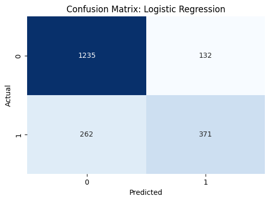
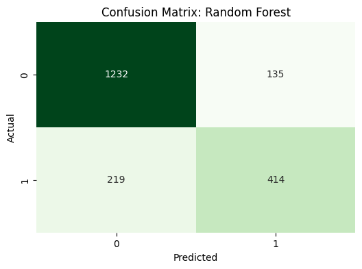

# Car Insurance Claim Prediction  
*Predicting whether a policyholder will file an insurance claim, supporting risk assessment and smarter pricing decisions.*

**Dataset**: 10,000 insurance policies (18 variables)  
**Techniques**: data cleaning, missing value imputation, one-hot encoding, baseline ML modeling  
**Key Result**: Random Forest achieved **82.3% accuracy** and improved claim detection (**recall 0.65** for claim class)

---

## Business Context

Insurance profitability depends on correctly pricing risk. Predicting which customers are more likely to file a claim helps insurers reduce avoidable losses, improve underwriting decisions, and allocate attention to higher-risk profiles.

In practice, a model like this can support decisions such as:
- pricing and premium adjustments
- underwriting rules
- early risk monitoring during the policy period

---

## Dataset

This project uses a structured dataset (`car_insurance.csv`) containing **10,000 customers/policies** and **18 columns**, including demographic, driving and vehicle-related information.

Key variables include:
- customer profile: `age`, `gender`, `income`, `education`, `credit_score`
- driving and risk indicators: `driving_experience`, `speeding_violations`, `duis`, `past_accidents`, `annual_mileage`
- vehicle context: `vehicle_type`, `vehicle_year`, `vehicle_ownership`
- target: `outcome` (claim vs. no claim)

Data quality notes:
- Missing values exist in **2 numeric features**: `credit_score` and `annual_mileage`

---

## Problem Statement

Can we predict whether a customer will file an insurance claim during the policy period based on their profile and driving history, in order to support risk-aware decision-making?

---

## Objectives

- Perform a clean and structured workflow from raw data to modeling  
- Handle missing values and ensure features are ready for machine learning  
- Encode categorical variables and validate final feature set  
- Train and compare **two baseline classification models**  
- Evaluate performance with business-relevant metrics (especially claim detection)  
- Translate results into insights for insurance risk assessment

---

## Methodology

1. **Data Cleaning and Preprocessing**  
   - Converted and validated columns  
   - Filled missing values in `credit_score` and `annual_mileage` using the **median** (robust choice when outliers may exist)

2. **Feature Engineering and Encoding**  
   - Applied **one-hot encoding** to all categorical features  
   - Removed `id` from modeling (no predictive value)  
   - Final feature set: **21 numerical features**

3. **Train/Test Split**  
   - 80% training / 20% testing  
   - Train: 8,000 rows | Test: 2,000 rows

4. **Modeling and Comparison**  
   - **Logistic Regression** (interpretable baseline)  
   - **Random Forest** (captures non-linear patterns)

5. **Evaluation and Interpretation**  
   - Accuracy, confusion matrix and classification report  
   - Focus on class 1 (claim) performance, since missing claims is usually costly

---

## Tools & Technologies

- Python (Pandas, NumPy)  
- Matplotlib, Seaborn  
- Scikit-learn (train_test_split, LogisticRegression, RandomForestClassifier)  
- Metrics: accuracy, confusion matrix, precision/recall/F1  

---

## Exploratory Data Analysis Highlights

Key preparation findings:
- Dataset is largely complete, with missing values only in two numeric columns  
- After median imputation, the dataset has **0 missing values**  
- Encoding converted categorical variables into a model-ready feature matrix (21 features)

---

## Modeling Approach

This project compares two models with complementary strengths:

**Logistic Regression**  
Used as a simple baseline. It is fast, easy to interpret, and often performs well when relationships are mostly linear.

**Random Forest**  
Chosen as a stronger baseline capable of capturing non-linear interactions between risk factors (e.g., past accidents combined with mileage and experience).

---

## Model Performance

Two models were evaluated on the test dataset.

Accuracy results:

- Logistic Regression: **0.803**
- Random Forest: **0.823**

Although the difference in accuracy is moderate, a deeper look at the confusion matrices helps understand how the models behave in practice.

### Logistic Regression



**Figure:** Confusion matrix for the Logistic Regression model.

Interpretation:

- True Negatives: **1235**
- False Positives: **132**
- False Negatives: **262**
- True Positives: **371**

Logistic Regression performs well at identifying **customers who will not make a claim**, but it misses a larger number of actual claim cases.  
From a business perspective, this means some risky customers could remain undetected.

---

### Random Forest



**Figure:** Confusion matrix for the Random Forest model.

Interpretation:

- True Negatives: **1232**
- False Positives: **135**
- False Negatives: **219**
- True Positives: **414**

Random Forest improves the detection of real claims, reducing false negatives compared to Logistic Regression.

This improvement is particularly important for insurance applications, where missing a potential claim may lead to financial risk.

---

Overall, **Random Forest provides the best balance between precision and recall**, making it the preferred model for this dataset.
---

## Key Insights

- **Random Forest is more reliable for risk detection**: it improves recall for claims (0.65 vs. 0.59), which is important when the cost of missing a claim is high.  
- **Logistic Regression remains a solid baseline**: strong performance for no-claim cases and a good starting point for interpretability.  
- **Driving behavior variables are valuable**: features like `past_accidents`, `speeding_violations`, `duis`, and `annual_mileage` are typical real-world indicators of risk exposure and are essential for this type of task.

---

## Business Impact

Potential real-world use cases:

- **Risk assessment / underwriting support**  
  Prioritize deeper review of customers predicted as high-risk.

- **Pricing strategy**  
  Use risk scores as one component to refine pricing tiers.

- **Operational efficiency**  
  Focus retention and proactive communication on profiles with higher predicted claim probability.

- **KPI monitoring**  
  Track claim risk distribution over time and by customer segments.

---

## Limitations

- This is a baseline approach without hyperparameter tuning or calibration.  
- The dataset may have class imbalance (more no-claim than claim), which affects how accuracy should be interpreted.  
- Some variables (e.g., postal code) may carry location signal but also raise concerns about generalization and fairness depending on usage context.

---

## Next Steps

- Hyperparameter tuning for Random Forest (GridSearchCV)  
- Try additional models (Gradient Boosting / XGBoost, calibrated models)  
- Evaluate with additional metrics: ROC-AUC, PR-AUC, cost-sensitive evaluation  
- Handle imbalance with class weights or resampling techniques  
- Add model interpretation (feature importance, SHAP) for explainability  
- Build a simple dashboard for monitoring risk scores and key drivers

---

## Repository Structure
```
.
├── data
├── notebooks
├── images
├── requirements.txt
└── README.md
```

---

## Strategic Perspective

In this project, I made deliberate choices to keep the workflow clean and easy to follow, prioritizing clarity and business relevance. I focused on comparing an interpretable baseline with a more flexible model, and I interpreted results with attention to what matters in insurance: identifying claim cases without sacrificing overall reliability.

---

## Conclusion

This project built an end-to-end machine learning workflow to predict car insurance claims. After cleaning and encoding the data, two models were trained and compared. Random Forest achieved the best balance, improving claim detection while keeping strong overall accuracy. The final result shows how structured modeling can support risk-aware decisions in insurance pricing and underwriting.
